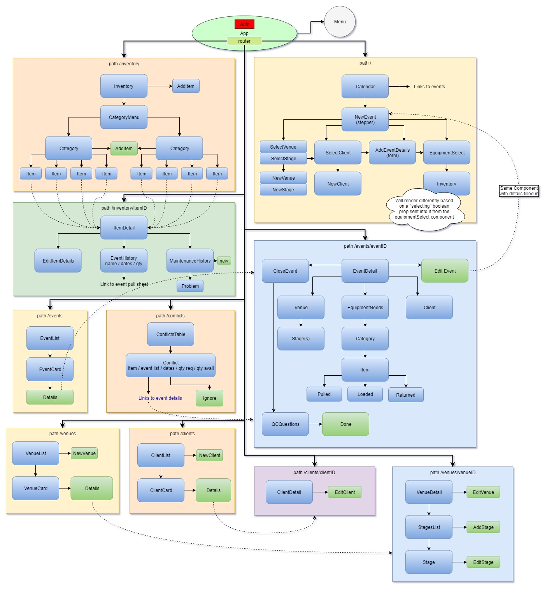

# EM-Pro

project build viewable in current state at https://em-pro-audio-88747.firebaseapp.com

### Author: Colin Worf

A full featured equipment management platform for multi-location Pro Audio companies, with inventory management, conflict notifications, event lifecycle tracking, and more.

### MVP
- user can click a date on a calendar and fill out a pull sheet (event details and equipment needs)
- user can check to see if there are any conflicts on future equipment needs
- user can add inventory to database with the ability to distinguish the number of items in each location
- user can save venue details (including multiple separate stage's power and rigging details) for later use in pull sheets
- user can save client details for later use in pull sheets
- user can sign off on every piece of equipment on every stage of the event (pulled, loaded, returned)

### Tools Used
- React JavaScript framework
- MobX state management
- firestorter (enhanced mobx obserevable and firestore bindings)
- FireBase user authentication
- FireStore NoSQL database
- Material-UI
- react-big-calendar (npm module)

### Beyond MVP
- user can set to return the equipment to a different location (during the final return stage of the process)
- user can note problems and fixes on specific pieces of equipment and view repair history of each item
- user can track purchase dates and warrantee status through serial numbers of all purchased equipment
- user can keep track of crew requirements (Prep Crew, Load Crew, Show Crew, Strike Crew, QC Crew)
- crew hours and performance ratings can be managed
- switch between light and dark theme for use in various environments (possibly auto detect the ambient light level and adjust theme automatically)
- Get total weight and volume of equipment list

## Component Flow Chart

